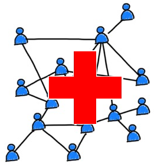

<!-- Improved compatibility of back to top link: See: https://github.com/othneildrew/Best-README-Template/pull/73 -->
<a name="readme-top"></a>
<!--
*** Thanks for checking out the Best-README-Template. If you have a suggestion
*** that would make this better, please fork the repo and create a pull request
*** or simply open an issue with the tag "enhancement".
*** Don't forget to give the project a star!
*** Thanks again! Now go create something AMAZING! :D
-->

<!-- PROJECT SHIELDS -->
<!--
*** I'm using markdown "reference style" links for readability.
*** Reference links are enclosed in brackets [ ] instead of parentheses ( ).
*** See the bottom of this document for the declaration of the reference variables
*** for contributors-url, forks-url, etc. This is an optional, concise syntax you may use.
*** https://www.markdownguide.org/basic-syntax/#reference-style-links
-->
[![Contributors][contributors-shield]][contributors-url]
[![Forks][forks-shield]][forks-url]
[![Stargazers][stars-shield]][stars-url]
[![Issues][issues-shield]][issues-url]
[![MIT License][license-shield]][license-url]
[![LinkedIn][linkedin-shield]][linkedin-url]

<!-- PROJECT LOGO -->
<br />
<div align="center">
  <a href="https://github.com/Vitor-Almeida/healthGraphOpt">
    
  </a>

<h3 align="center">Optimal Allocation of Cancer patients during a pandemic</h3>

  <p align="center">
    More than 50% of all Cancer patients were unable to receive care during the SARS-CoV-2 pandemic because of crowded beds, high risk of contamination or long travelling distances to get treatment. This project aims to optimally find the best allocation to these patients by minimizing travelled distance and contamination risk. Several constrains to the model were used, like: available equipment, beds, and medical staff per Hospital. 
    <br />
    <a href="https://github.com/Vitor-Almeida/healthGraphOpt"><strong>Explore the docs »</strong></a>
    <br />
    <br />
    <a href="https://github.com/Vitor-Almeida/healthGraphOpt">View Demo</a>
    ·
    <a href="https://github.com/Vitor-Almeida/healthGraphOpt/issues">Report Bug</a>
    ·
    <a href="https://github.com/Vitor-Almeida/healthGraphOpt/issues">Request Feature</a>
  </p>
</div>


<!-- TABLE OF CONTENTS -->
<details>
  <summary>Table of Contents</summary>
  <ol>
    <li>
      <a href="#about-the-project">About The Project</a>
      <ul>
        <li><a href="#built-with">Built With</a></li>
      </ul>
    </li>
    <li>
      <a href="#getting-started">Getting Started</a>
      <ul>
        <li><a href="#prerequisites">Prerequisites</a></li>
        <li><a href="#installation">Installation</a></li>
      </ul>
    </li>
    <li><a href="#usage">Usage</a></li>
    <li><a href="#roadmap">Roadmap</a></li>
    <li><a href="#contributing">Contributing</a></li>
    <li><a href="#license">License</a></li>
    <li><a href="#contact">Contact</a></li>
    <li><a href="#acknowledgments">Acknowledgments</a></li>
  </ol>
</details>


<!-- ABOUT THE PROJECT -->
## About The Project

[![Product Name Screen Shot][product-screenshot]](https://example.com)

Here's a blank template to get started: To avoid retyping too much info. Do a search and replace with your text editor for the following: `Vitor-Almeida`, `healthGraphOpt`, `twitter_handle`, `linkedin_username`, `email_client`, `email`, `project_title`, `project_description`

<p align="right">(<a href="#readme-top">back to top</a>)</p>

### Built With

* [![Python.py][Python.py]][Python-url]
* [![Pandas.py][Pandas.py]][Pandas-url]
* [![Numpy.py][Numpy.py]][Numpy-url]
* [![PowerBI][PowerBI]][PowerBI-url]

<p align="right">(<a href="#readme-top">back to top</a>)</p>

<!-- GETTING STARTED -->
## Getting Started

This is an example of how you may give instructions on setting up your project locally.
To get a local copy up and running follow these simple example steps.

### Prerequisites

This is an example of how to list things you need to use the software and how to install them.
* npm
  ```sh
  npm install npm@latest -g
  ```

### Installation

1. Get a free API Key at [https://example.com](https://example.com)
2. Clone the repo
   ```sh
   git clone https://github.com/Vitor-Almeida/healthGraphOpt.git
   ```
3. Install NPM packages
   ```sh
   npm install
   ```
4. Enter your API in `config.js`
   ```js
   const API_KEY = 'ENTER YOUR API';
   ```

<p align="right">(<a href="#readme-top">back to top</a>)</p>

<!-- USAGE EXAMPLES -->
## Usage

Use this space to show useful examples of how a project can be used. Additional screenshots, code examples and demos work well in this space. You may also link to more resources.

_For more examples, please refer to the [Documentation](https://example.com)_

<p align="right">(<a href="#readme-top">back to top</a>)</p>

<!-- ROADMAP -->
## Roadmap

- [ ] Feature 1
- [ ] Feature 2
- [ ] Feature 3
    - [ ] Nested Feature

See the [open issues](https://github.com/Vitor-Almeida/healthGraphOpt/issues) for a full list of proposed features (and known issues).

<p align="right">(<a href="#readme-top">back to top</a>)</p>

<!-- CONTRIBUTING -->
## Contributing

Contributions are what make the open source community such an amazing place to learn, inspire, and create. Any contributions you make are **greatly appreciated**.

If you have a suggestion that would make this better, please fork the repo and create a pull request. You can also simply open an issue with the tag "enhancement".
Don't forget to give the project a star! Thanks again!

1. Fork the Project
2. Create your Feature Branch (`git checkout -b feature/AmazingFeature`)
3. Commit your Changes (`git commit -m 'Add some AmazingFeature'`)
4. Push to the Branch (`git push origin feature/AmazingFeature`)
5. Open a Pull Request

<p align="right">(<a href="#readme-top">back to top</a>)</p>

<!-- REFERENCES -->
## References

1. [Adam F. Abdin, Y.-P. F. (2021). An optimization model for planning testing and control strategies to limit the spread of a pandemic – The case of COVID-19. European Journal of Operational Research, 308-324.](https://www.ncbi.nlm.nih.gov/pmc/articles/PMC8614228/)

2. [Li Sun, G. W. (2014). Multi-objective optimization models for patient allocation during a pandemic influenza outbreak. Computers & Operations Research, 350-359.](https://www.sciencedirect.com/science/article/abs/pii/S0305054813003468)

3. [M. Bonsignore, S. H. (2022). Burden of hospital-acquired SARS-CoV-2 infections in Germany: occurrence and outcomes of different variants. Journal of Hospital Infection , 82-88.](https://www.sciencedirect.com/science/article/pii/S0195670122002584)

4. [Nezir Aydin, Z. C. (2022). Analyses on ICU and non-ICU capacity of government hospitals during the COVID-19 outbreak via multi-objective linear programming: An evidence from Istanbul. Computers in Biology and Medicine , 1-22.](https://pubmed.ncbi.nlm.nih.gov/35569338/)

5. [Osama M. Al-Quteimat, A. M. (2020). The Impact of the COVID-19 Pandemic on Cancer Patients. American Journal of Clinical Oncology.](https://pubmed.ncbi.nlm.nih.gov/32304435/)

<p align="right">(<a href="#readme-top">back to top</a>)</p>

<!-- LICENSE -->
## License

Distributed under the MIT License. See `LICENSE.txt` for more information.

<p align="right">(<a href="#readme-top">back to top</a>)</p>

<!-- CONTACT -->
## Contact

Vitor Freitas de Almeida - [linkedin](https://www.linkedin.com/in/vitorfalmeida/) - almeida.f.vitor@gmail.com

Project Link: [https://github.com/Vitor-Almeida/healthGraphOpt](https://github.com/Vitor-Almeida/healthGraphOpt)

<p align="right">(<a href="#readme-top">back to top</a>)</p>

<!-- MARKDOWN LINKS & IMAGES -->
<!-- https://www.markdownguide.org/basic-syntax/#reference-style-links -->
[contributors-shield]: https://img.shields.io/github/contributors/Vitor-Almeida/healthGraphOpt.svg?style=for-the-badge
[contributors-url]: https://github.com/Vitor-Almeida/healthGraphOpt/graphs/contributors
[forks-shield]: https://img.shields.io/github/forks/Vitor-Almeida/healthGraphOpt.svg?style=for-the-badge
[forks-url]: https://github.com/Vitor-Almeida/healthGraphOpt/network/members
[stars-shield]: https://img.shields.io/github/stars/Vitor-Almeida/healthGraphOpt.svg?style=for-the-badge
[stars-url]: https://github.com/Vitor-Almeida/healthGraphOpt/stargazers
[issues-shield]: https://img.shields.io/github/issues/Vitor-Almeida/healthGraphOpt.svg?style=for-the-badge
[issues-url]: https://github.com/Vitor-Almeida/healthGraphOpt/issues
[license-shield]: https://img.shields.io/github/license/Vitor-Almeida/healthGraphOpt.svg?style=for-the-badge
[license-url]: https://github.com/Vitor-Almeida/healthGraphOpt/blob/master/LICENSE.txt
[linkedin-shield]: https://img.shields.io/badge/-LinkedIn-black.svg?style=for-the-badge&logo=linkedin&colorB=555
[linkedin-url]: https://linkedin.com/in/vitorfalmeida
[product-screenshot]: docs/screenshot.png
[Next.js]: https://img.shields.io/badge/next.js-000000?style=for-the-badge&logo=nextdotjs&logoColor=white

[Python.py]:https://img.shields.io/badge/python-3670A0?style=for-the-badge&logo=python&logoColor=ffdd54
[python-url]:https://www.python.org/
[Pandas.py]:https://img.shields.io/badge/pandas-%23150458.svg?style=for-the-badge&logo=pandas&logoColor=white
[Pandas-url]:https://pandas.pydata.org/
[Numpy.py]:https://img.shields.io/badge/numpy-%23013243.svg?style=for-the-badge&logo=numpy&logoColor=white
[Numpy-url]:https://numpy.org/
[PowerBI]:https://img.shields.io/badge/power_bi-F2C811?style=for-the-badge&logo=powerbi&logoColor=black
[PowerBI-url]:https://powerbi.microsoft.com/pt-br/

[Next-url]: https://nextjs.org/
[React.js]: https://img.shields.io/badge/React-20232A?style=for-the-badge&logo=react&logoColor=61DAFB
[React-url]: https://reactjs.org/
[Vue.js]: https://img.shields.io/badge/Vue.js-35495E?style=for-the-badge&logo=vuedotjs&logoColor=4FC08D
[Vue-url]: https://vuejs.org/
[Angular.io]: https://img.shields.io/badge/Angular-DD0031?style=for-the-badge&logo=angular&logoColor=white
[Angular-url]: https://angular.io/
[Svelte.dev]: https://img.shields.io/badge/Svelte-4A4A55?style=for-the-badge&logo=svelte&logoColor=FF3E00
[Svelte-url]: https://svelte.dev/
[Laravel.com]: https://img.shields.io/badge/Laravel-FF2D20?style=for-the-badge&logo=laravel&logoColor=white
[Laravel-url]: https://laravel.com
[Bootstrap.com]: https://img.shields.io/badge/Bootstrap-563D7C?style=for-the-badge&logo=bootstrap&logoColor=white
[Bootstrap-url]: https://getbootstrap.com
[JQuery.com]: https://img.shields.io/badge/jQuery-0769AD?style=for-the-badge&logo=jquery&logoColor=white
[JQuery-url]: https://jquery.com 
